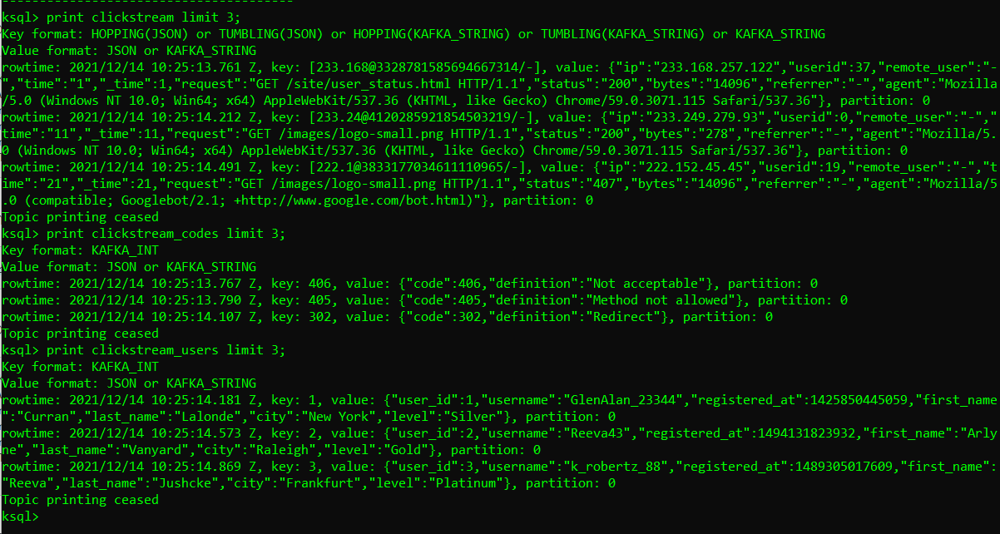

# HW Report

Deploy the demo in Docker

Create the necessary connectors by running a script

Sample data from generators

See the connectors on WEB UI at http://localhost:9021/

Create streams by running a script

View the flow in WEB UI

Query some stream to verify the data

Send data to Grafana and create a dashboard via scripts

View the dashboard in Grafana at http://localhost:3000/

See that additional Elasticsearch connectors have been created

Emulate sessionizing the data and view the effects in Grafana

